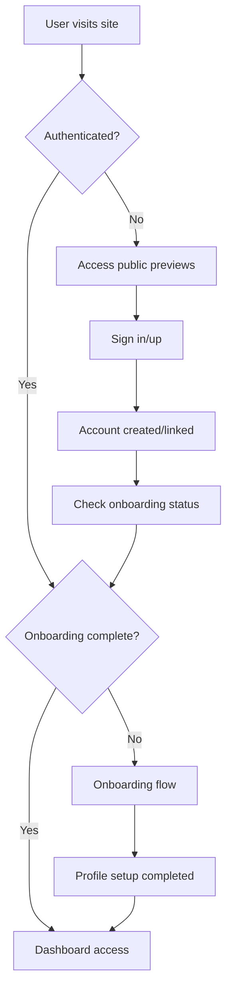
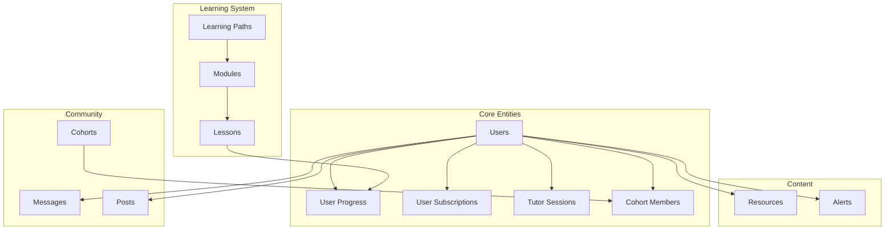
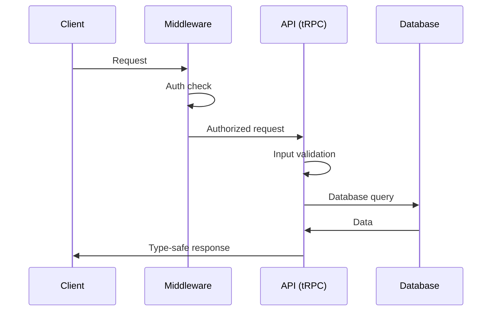

# 🍯 MeliMou Documentation

Welcome to the comprehensive documentation for MeliMou, a modern Greek language learning platform. This documentation provides everything you need to understand, maintain, and extend the codebase.

## 🎯 Quick Start

**New to the project?** Start here:
1. 📖 [Architecture Overview](#-architecture-overview) - Understand the big picture
2. 🚀 [Developer Guide](./DEVELOPER_GUIDE.md) - Get your environment running
3. 🔗 [API Documentation](./API.md) - Explore available endpoints
4. 🏗️ [Detailed Architecture](./ARCHITECTURE.md) - Deep dive into system design

## 📋 Documentation Index

### 🏗️ Architecture & Design
- **[Architecture Overview](./ARCHITECTURE.md)** - System design, tech stack, and architectural decisions
- **[API Documentation](./API.md)** - Complete tRPC API reference with examples
- **[Database Schema](../src/server/db/schema.ts)** - Comprehensive database design with comments

### 🚀 Development
- **[Developer Guide](./DEVELOPER_GUIDE.md)** - Setup, workflows, and contribution guidelines
- **[Environment Setup](../setup-env.sh)** - Automated environment configuration
- **[Database Setup](../setup-postgresql.sh)** - PostgreSQL installation and configuration

### 🔧 Core Components
- **[Authentication System](../src/server/auth.ts)** - NextAuth.js configuration and OAuth providers
- **[tRPC Configuration](../src/server/api/trpc.ts)** - Type-safe API setup and middleware
- **[Middleware](../src/middleware.ts)** - Route protection and authentication flow
- **[Root Layout](../src/app/layout.tsx)** - Application shell and provider setup

## 🏗️ Architecture Overview

### 🛠️ Tech Stack
```
Frontend:          Next.js 14 (App Router) + TypeScript + Tailwind CSS
Backend:           tRPC + Drizzle ORM + PostgreSQL
Authentication:    NextAuth.js (OAuth + Email/Password)
Styling:           Tailwind CSS + Shadcn/ui components
Database:          PostgreSQL with Drizzle ORM
Deployment:        Vercel (frontend) + Railway/Supabase (database)
```

### 🎨 Design Philosophy
- **🍯 Honey Theme**: Warm, inviting design with purple-to-amber gradients
- **📱 Mobile-First**: Responsive design optimized for all devices
- **🎯 User-Centric**: Intuitive navigation and beautiful user experience
- **🔒 Security-First**: Comprehensive authentication and data protection
- **⚡ Performance**: Optimized for speed with modern web technologies

### 🗂️ Project Structure
```
MeliMou/
├── 📁 docs/                    # Documentation files
├── 📁 drizzle/                 # Database migrations
├── 📁 public/                  # Static assets
├── 📁 scripts/                 # Utility scripts
├── 📁 src/
│   ├── 📁 app/                 # Next.js app router pages
│   │   ├── 📁 api/             # API routes (tRPC)
│   │   ├── 📁 auth/            # Authentication pages
│   │   ├── 📁 dashboard/       # User dashboard
│   │   └── 📁 components/      # Page-specific components
│   ├── 📁 components/          # Shared UI components
│   │   ├── 📁 ui/              # Base UI components (Shadcn)
│   │   ├── 📁 alert-system/    # Notification components
│   │   ├── 📁 chat-panel/      # Community chat
│   │   ├── 📁 learning-path/   # Course components
│   │   └── 📁 tutor-interface/ # AI tutoring UI
│   ├── 📁 server/              # Backend logic
│   │   ├── 📁 api/             # tRPC routers and procedures
│   │   ├── 📁 db/              # Database configuration
│   │   └── auth.ts             # Authentication configuration
│   └── 📁 lib/                 # Utility functions
└── 📊 Database Schema          # 15+ tables with relationships
```

## 🔗 System Integration

### 🔐 Authentication Flow


### 🏛️ Data Architecture


### 🔄 Request Flow


## 🚀 Key Features

### 🤖 AI-Powered Learning
- **Interactive Tutoring**: Conversational AI for personalized Greek lessons
- **Progress Tracking**: Comprehensive analytics and learning insights
- **Adaptive Content**: Dynamic difficulty adjustment based on performance

### 👥 Community Learning
- **Live Cohorts**: Small group learning with native speakers
- **Peer Support**: Community forums and chat system
- **Cultural Immersion**: Greek culture integration throughout content

### 💳 Subscription System
- **Tiered Access**: Free, Pro, and Premium subscription levels
- **Stripe Integration**: Secure payment processing
- **Feature Gating**: Progressive access to premium content

### 📱 Modern Experience
- **Responsive Design**: Beautiful experience on all devices
- **Offline Support**: Progressive Web App capabilities
- **Performance**: Optimized loading and smooth interactions

## 🔧 Development Workflows

### 🛠️ Common Tasks
```bash
# Start development server
npm run dev

# Database operations
npm run db:generate    # Generate migrations
npm run db:migrate     # Apply migrations
npm run db:push        # Push schema changes
npm run db:studio      # Open database GUI

# Type checking and linting
npm run type-check     # TypeScript validation
npm run lint           # ESLint checks
npm run format         # Prettier formatting

# Testing
npm run test           # Run test suite
npm run test:watch     # Watch mode
```

### 📝 Code Quality Standards
- **TypeScript**: Strict type checking enabled
- **ESLint**: Airbnb configuration with custom rules
- **Prettier**: Consistent code formatting
- **Husky**: Pre-commit hooks for quality gates

## 🤝 Contributing

### 📋 Development Process
1. **Fork & Clone**: Start with the latest main branch
2. **Environment**: Follow [Developer Guide](./DEVELOPER_GUIDE.md) setup
3. **Branch**: Create feature branch (`feature/description`)
4. **Develop**: Write code with comprehensive comments
5. **Test**: Ensure all tests pass and add new ones
6. **Document**: Update relevant documentation
7. **Submit**: Create pull request with detailed description

### 🎯 Contribution Areas
- **🌐 Internationalization**: Add support for more languages
- **🤖 AI Features**: Enhance tutoring capabilities
- **📱 Mobile**: Improve mobile experience
- **🎨 Design**: Refine honey theme and accessibility
- **⚡ Performance**: Optimize loading and interactions
- **📊 Analytics**: Add learning insights and reporting

## 📞 Support & Resources

### 🔗 External Documentation
- **[Next.js 14](https://nextjs.org/docs)** - Framework documentation
- **[tRPC](https://trpc.io/docs)** - Type-safe API documentation
- **[Drizzle ORM](https://orm.drizzle.team/docs)** - Database ORM guide
- **[NextAuth.js](https://next-auth.js.org/)** - Authentication library
- **[Tailwind CSS](https://tailwindcss.com/docs)** - Styling framework
- **[Shadcn/ui](https://ui.shadcn.com/)** - Component library

### 🐛 Troubleshooting
- **Database Issues**: Check [Developer Guide](./DEVELOPER_GUIDE.md#database-setup)
- **Authentication**: Review [auth configuration](../src/server/auth.ts)
- **Type Errors**: Ensure latest schema types with `npm run db:generate`
- **Build Errors**: Clear `.next` folder and reinstall dependencies

---

**🍯 Happy coding with MeliMou!** This documentation is maintained alongside the codebase to ensure accuracy and usefulness for all contributors. 